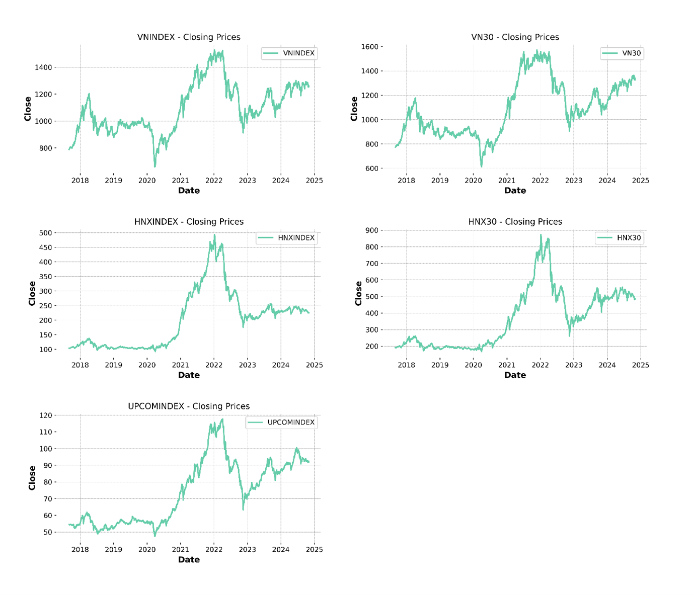
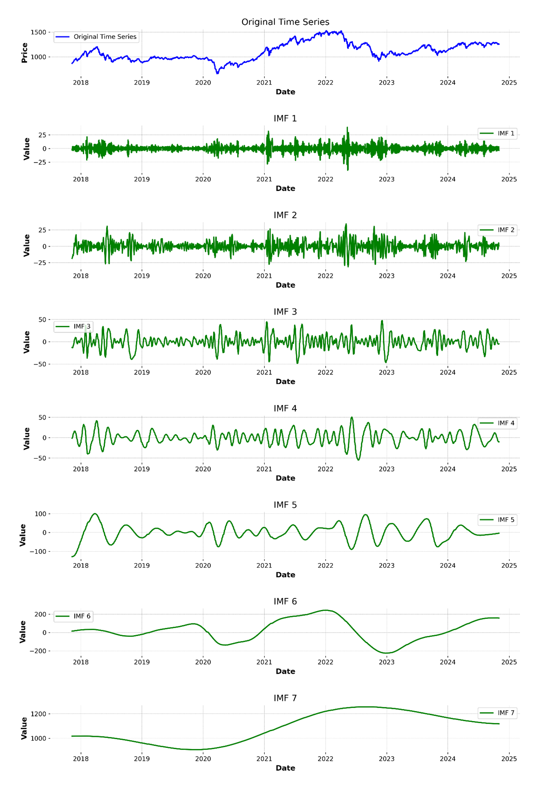
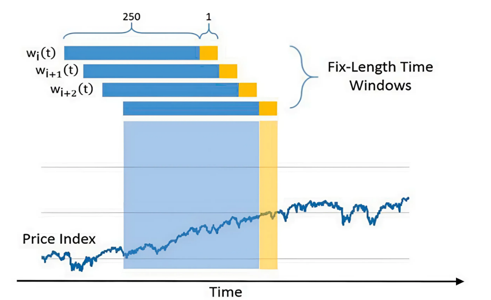
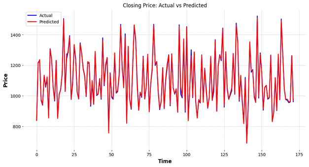
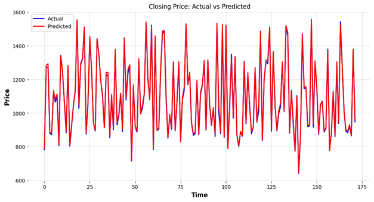

# 📊 Stock Price Forecasting with CEEMDAN–CNN–LSTM  
*A Data-Driven Business Intelligence Project for Financial Decision Support*  

This repository presents my project on forecasting Vietnam’s major stock indices.  
By combining **signal decomposition (CEEMDAN)** with **deep learning (CNN–LSTM)**, this project demonstrates how advanced analytics can deliver **accurate, actionable insights** to empower **investors, portfolio managers, and BI teams**.  

---

## 🎯 Business Motivation
Financial markets are volatile, complex, and influenced by countless variables.  
For **business analysts and decision-makers**, inaccurate forecasting can lead to:  
- Misaligned investment strategies  
- Increased risk exposure  
- Lost opportunities  

👉 This project tackles these challenges by showing how **predictive analytics** can reduce uncertainty, strengthen risk management, and drive smarter, data-driven decisions.  

---

## 🔍 Project Objectives
1. **Develop a predictive model** that handles noisy, non-linear financial time series.  
2. **Benchmark forecasting accuracy** using standard metrics (RMSE, MAE, MAPE).  
3. **Translate analytics into business insights** for investment planning and BI reporting.  

---

## 📊 Data Overview
- **Source**: VNStock API  
- **Period**: Sep 2017 – Oct 2024  
- **Indices**: VNINDEX, VN30, HNXINDEX, HNX30, UPCOMINDEX  
- **Features**: Daily open, close, high, low, volume  

### Example: Raw Market Trends  
  
*Volatility patterns across 5 indices (2017–2024)*  

---

## ⚙️ Methodology
### 1. Data Preprocessing  
- Cleaned missing values & anomalies  
- Normalized variables for stability  

### 2. CEEMDAN Signal Decomposition  
- Broke down raw stock signals into IMFs + residuals  
- Reduced noise → clearer forecasting patterns  
  
*CEEMDAN separates complex signals into components (IMFs)*  

### 3. Hybrid Deep Learning (CNN + LSTM)  
- **CNN**: extracted local short-term features  
- **LSTM**: captured long-term sequential dependencies  
- Combined → robust forecast reconstruction  
  
*Sliding-window process for sequential training*  

### 4. Evaluation Metrics  
- **RMSE, MAE, MAPE** for error quantification  

---

## 🚀 Key Results & Business Value
| Index       | RMSE  | MAE  | MAPE (%) |
|-------------|-------|------|----------|
| **VNINDEX** | 0.01  | 0.01 | **2.15** |
| VN30        | 0.01  | 0.01 | 2.22     |
| UPCOMINDEX  | 0.01  | 0.01 | 2.96     |
| HNXINDEX    | 0.01  | 0.00 | 3.80     |
| HNX30       | 0.01  | 0.00 | 5.55     |

✨ **Business Intelligence Impact**:  
- Forecasts with **2–5% error rates** enable **better scenario analysis**.  
- Accurate short/long-term predictions support **portfolio allocation** and **risk control**.  
- Demonstrates how BI teams can turn raw time series into **decision-ready insights**.  

### Sample Forecasts
  
*Actual vs Predicted (VNINDEX)*  

  
*Actual vs Predicted (VN30)*  

---

## 💡 Insights for Business Analysts & BI Teams
- **From Data to Decisions**: Advanced models can reduce volatility noise → improve confidence in reports.  
- **Risk Intelligence**: With lower forecast errors, BI dashboards can provide more reliable “what-if” scenarios.  
- **Scalable Framework**: Same methodology can extend to **individual stocks, bonds, FX, or commodities**.  
- **BI Integration**: A clear case of blending **data preprocessing, predictive modeling, and visualization** to enhance **executive dashboards & strategy alignment**.  

---

## 🛠️ Tech Stack
- **Languages**: Python  
- **Libraries**: NumPy, Pandas, Matplotlib, TensorFlow/Keras, libeemd  
- **Techniques**: CEEMDAN decomposition, CNN, LSTM, Time-Series Forecasting  
- **Focus**: Translating data science models into **business intelligence applications**  

---

## 📣 Author
👤 **Nguyen Thi Thanh Truc**  
- Bachelor of Investment Economics, UEH (Expected Oct 2025)  
- Skilled in **Data Analysis, Predictive Modeling, Business Intelligence**  
- Passionate about turning **complex datasets into insights that drive smarter decisions**  

---
